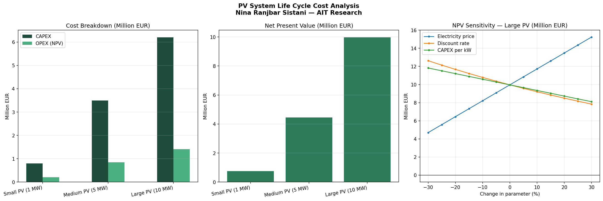

# PV System Life Cycle Cost Analysis (LCCA)

A Python model that works out what utility-scale solar PV plants really cost over their whole lifetime. It compares a few plant sizes and calculates the two numbers that matter most in energy economics: the Levelised Cost of Electricity (LCOE) and the Net Present Value (NPV).

## Overview

The economics of a PV plant depend heavily on its size, its upfront cost, how much it costs to run, and the financing assumptions behind it. This project runs a full Life Cycle Cost Analysis for three plant sizes — 1 MW, 5 MW and 10 MW — and then checks how sensitive the result is to the main financial drivers. All figures are set for Austrian conditions.

## Methodology

Every cost and every unit of energy is discounted back to today's value using the same discount rate. The panels also lose a little output each year, so the annual energy yield falls over time.

LCOE is the ratio of total discounted cost to total discounted energy:

```
LCOE = (CAPEX + Σ discounted OPEX) / (Σ discounted energy)
```

Cost and energy are discounted at the same rate. That isn't a quirk — it drops out of solving NPV = 0 for the price, which is the correct way to level a cost.

NPV is the discounted revenue minus the discounted costs, with the CAPEX paid up front in year zero:

```
NPV = Σ discounted revenue − CAPEX − Σ discounted OPEX
```

## Key assumptions

| Parameter | Value |
| --- | --- |
| Project lifetime | 25 years |
| Discount rate | 5% |
| Electricity price | 0.06 EUR/kWh |
| Degradation rate | 0.5% per year |
| Capacity factor | 0.12 (Austria) |

The capacity factor of 0.12 reflects Austria's solar yield of roughly 1,000 kWh per kWp a year. CAPEX and OPEX per kW are lower for the bigger plants, which is where economies of scale show up. The cost figures are based on IEA-PVPS Austria (2024) and IRENA's Renewable Power Generation Costs, which put utility-scale PV in Austria at around 500–650 EUR/kW.

## Results (base case)

| System | CAPEX (M€) | LCOE (€/kWh) | NPV (M€) |
| --- | --- | --- | --- |
| Small PV (1 MW) | 0.65 | 0.06 | −0.02 |
| Medium PV (5 MW) | 2.90 | 0.05 | 0.47 |
| Large PV (10 MW) | 5.20 | 0.05 | 1.83 |

The two larger plants are cheaper per kWh and clearly profitable, thanks to their lower per-kW costs. The 1 MW plant is the exception: at an electricity price of 0.06 €/kWh its NPV comes out slightly negative, so at that price it doesn't quite pay for itself. The LCOE values line up with published Austrian utility-scale figures of about 0.04–0.06 €/kWh, which is a good sign that the model behaves realistically.

The sensitivity analysis shows the electricity price moves the NPV more than anything else, followed by the discount rate and then CAPEX. Put simply, the price you can sell power at is the biggest risk to the project.



## Features

- CAPEX and OPEX modelling
- Discounted multi-year cash flow analysis
- Discounted LCOE and NPV calculation
- One-way sensitivity analysis on electricity price, discount rate and CAPEX
- Visual comparison of the three plant sizes

## Built with

- Python 3.x
- NumPy
- pandas
- Matplotlib

## Getting started

Clone the repository and install the dependencies:

```bash
git clone https://github.com/ninars1985-svg/pv-system-lcca.git
cd pv-system-lcca
pip install -r requirements.txt
```

Run the analysis:

```bash
python lcca_pv_system.py
```

The script prints the result and sensitivity tables to the console and saves the comparison charts as `lcca_results.png`.

## Author

**Nina Ranjbar Sistani** — Energy Systems Analyst
MSc Energy Management, BOKU Vienna
Research experience at the Austrian Institute of Technology (AIT)

## License

Released under the MIT License. See the [LICENSE](LICENSE) file for details.
